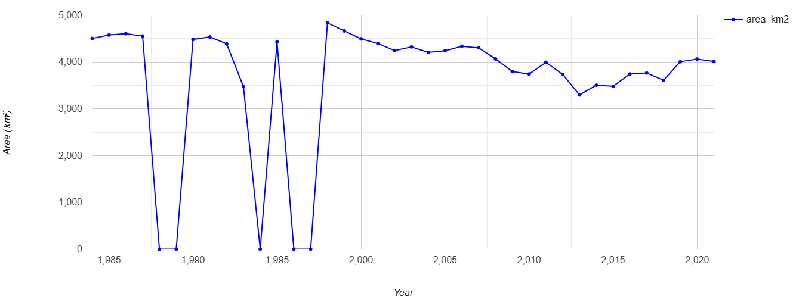
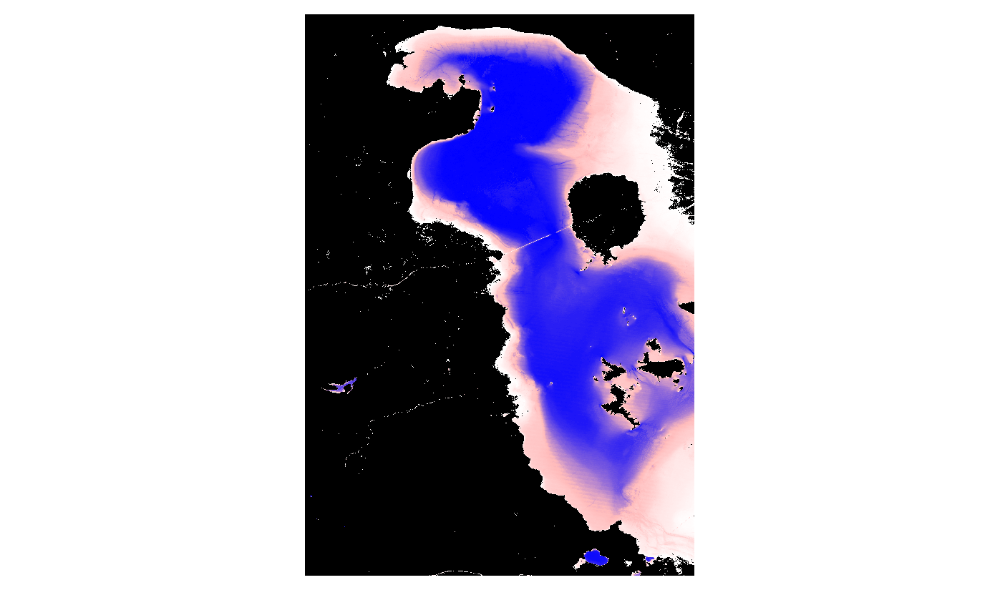
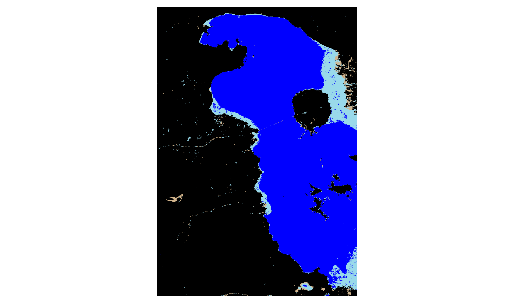
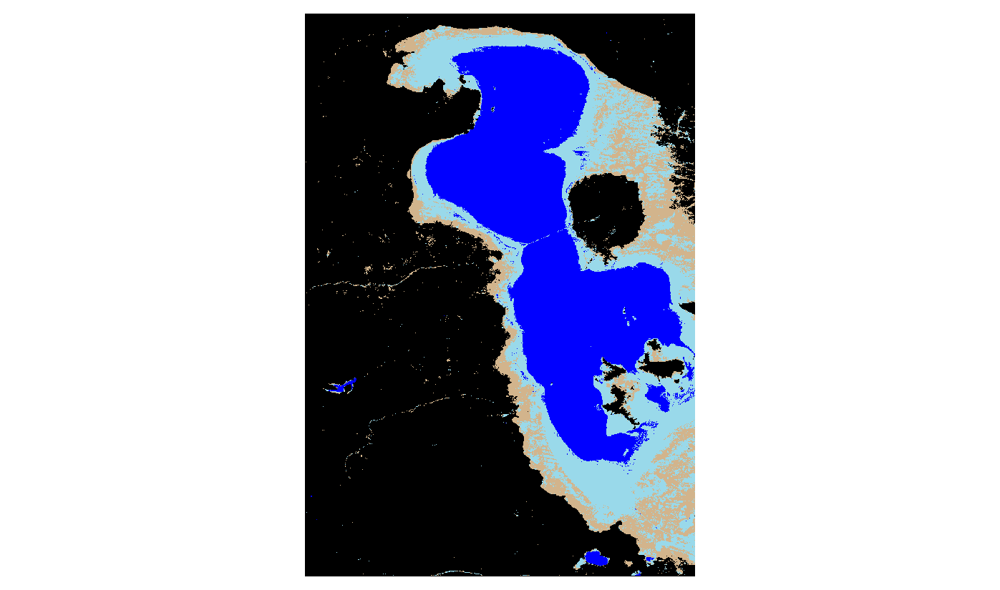

# Monitoring Lake Urmia Surface Water Changes (1984–2021) using Google Earth Engine

This project utilizes Google Earth Engine (GEE) to analyze and visualize the dramatic changes in the surface water area of Lake Urmia over the past few decades. By leveraging the **JRC Global Surface Water Dataset**, the script calculates yearly surface area, maps water occurrence, and compares historical extents to highlight the ecological changes in the region.

## 🌍 Project Overview

Lake Urmia, located in northwestern Iran, was once one of the largest hypersaline lakes in the world. However, due to climate change, prolonged droughts, and water mismanagement, it has experienced severe shrinkage. This repository provides a GEE JavaScript workflow to quantify and visualize this decline.

### Key Features
* **Water Occurrence Mapping:** Visualizes the long-term probability of finding water in the Lake Urmia basin.
* **Time-Series Analysis:** Calculates the total surface water area (in km²) for each year and generates an interactive line chart.
* **Temporal Comparisons:** Visually compares the lake's extent during a healthy year (1984) versus a depleted year (2021).
* **Automated Data Export:** Exports the time-series area data as a `.csv` and the generated maps as images directly to Google Drive.

---

## 📊 Visualizations

### 1. Surface Water Area Trend
The chart below illustrates the historical trajectory of Lake Urmia's surface area, showing drastic drops and extreme fluctuations over the years.



### 2. Historical Water Occurrence
This map highlights the frequency of water presence. Deep blue areas represent permanent water bodies, while lighter/reddish areas indicate seasonal or rare water presence.



### 3. Comparing 1984 vs. 2021
A stark visual comparison showing the lake's extent before the most severe shrinkage (1998) and its depleted state in recent years (2021).

| 1984 Extent | 2021 Extent |
| :---: | :---: |
|  |  |
| *Healthy water levels with a broad surface area.* | *Severe shrinkage, leaving behind vast seasonal and dry areas.* |

---

## 💻 Google Earth Engine Script

Below is the complete JavaScript code used for this analysis. You can run this directly in the [Google Earth Engine Code Editor](https://code.earthengine.google.com/).

```JavaScript
var dataset = ee.Image('JRC/GSW1_4/GlobalSurfaceWater');

var visualization = {
  bands: ['occurrence'],
  min: 0.0,
  max: 100.0,
  palette: ['ffffff', 'ffbbbb', '0000ff']
}; 

Map.setCenter(59.414, 45.182, 6);

Map.addLayer(dataset, visualization, 'Occurrence');
// Define the region of interest for Lake Urmia
var geometry = ee.Geometry.Rectangle([44.8, 37.0, 45.7, 38.3]);
Map.centerObject(geometry, 8);

// Step 1: Load and visualize water occurrence
var gsw = ee.Image("JRC/GSW1_4/GlobalSurfaceWater");
var occurrence = gsw.select("occurrence").clip(geometry);

var visOccurrence = {
  min: 0,
  max: 100,
  palette: ['ffffff', 'ffbbbb', '0000ff']
};
Map.addLayer(occurrence, visOccurrence, "Water Occurrence Map");

// Step 2: Create a water mask (Occurrence > 50%)
var water = occurrence.gt(50);
Map.addLayer(water, {palette: ['white', 'blue']}, "Water Mask (>50% occurrence)", false);

// Step 3: Calculate base statistics for >50% occurrence
var areaImage = water.multiply(ee.Image.pixelArea());
var stats = areaImage.reduceRegion({
  reducer: ee.Reducer.sum(),
  geometry: geometry,
  scale: 30,
  maxPixels: 1e13
});
print("Base Lake Area >50% Occurrence (m²):", stats);

// Step 4: Yearly area calculation (Strictly 1984 - 2021)
var yearlyCollection = ee.ImageCollection("JRC/GSW1_4/YearlyHistory")
  .filterDate('1984-01-01', '2022-01-01'); // Ensures strict inclusion of 1984 through 2021

var calculateArea = function(image) {
  // Class 2 is seasonal water, Class 3 is permanent water
  var water = image.select("waterClass").eq(2).or(image.select("waterClass").eq(3));
  var areaImage = water.multiply(ee.Image.pixelArea());
  
  var stats = areaImage.reduceRegion({
    reducer: ee.Reducer.sum(),
    geometry: geometry,
    scale: 30,
    maxPixels: 1e13
  });
  
  var year = image.get("year");
  
  return ee.Feature(null, {
    "year": year,
    "area_m2": stats.get("waterClass"),
    "area_km2": ee.Number(stats.get("waterClass")).divide(1e6)
  });
};

var clippedCollection = yearlyCollection.map(function(img) {
  return img.clip(geometry);
});

var areaFeatures = ee.FeatureCollection(clippedCollection.map(calculateArea));
print("Yearly Lake Area Table:", areaFeatures);

// Step 5: Generate Chart
var chart = ui.Chart.feature.byFeature(areaFeatures, "year", "area_km2")
  .setChartType("LineChart")
  .setOptions({
    title: "Lake Urmia Surface Water Area (1984-2021)",
    hAxis: {title: "Year", format: '####'},
    vAxis: {title: "Area (km²)"},
    lineWidth: 2,
    pointSize: 4,
    colors: ["0000ff"]
  });
print(chart);

// Step 6: Key-year comparison
var keyYears = [1984, 1990, 2000, 2010, 2020, 2021];
var keyYearFeatures = areaFeatures.filter(
  ee.Filter.inList("year", keyYears)
);
print("Key Year Comparison Data:", keyYearFeatures);

// Step 7: Load Start and End Years for visual comparison maps (1984 vs 2021)
var img1984 = ee.Image("JRC/GSW1_4/YearlyHistory/1984").select("waterClass").clip(geometry);
var img2021 = ee.Image("JRC/GSW1_4/YearlyHistory/2021").select("waterClass").clip(geometry);

var visClass = {
  min: 0, max: 3,
  palette: ['000000', 'd2b48c', '99d9ea', '0000ff']
  // 0=no data(black), 1=not water(tan), 2=seasonal(light blue), 3=permanent(blue)
};

Map.addLayer(img1984, visClass, "Lake Urmia 1984 (Start)");
Map.addLayer(img2021, visClass, "Lake Urmia 2021 (End)");

// Step 8: Export Data and Maps to Google Drive
Export.table.toDrive({
  collection: areaFeatures,
  description: "LakeUrmia_YearlyArea_1984_2021",
  folder: "EarthEngineExports",
  fileNamePrefix: "LakeUrmia_YearlyArea_1984_2021",
  fileFormat: "CSV"
});

Export.image.toDrive({
  image: occurrence.visualize(visOccurrence),
  description: "LakeUrmia_OccurrenceMap",
  folder: "EarthEngineExports",
  fileNamePrefix: "lake_urmia_occurrence_map",
  region: geometry,
  scale: 30,
  maxPixels: 1e13
});

Export.image.toDrive({
  image: img1984.visualize(visClass),
  description: "LakeUrmia_WaterClass_1984",
  folder: "EarthEngineExports",
  fileNamePrefix: "lake_urmia_1984_map",
  region: geometry,
  scale: 30,
  maxPixels: 1e13
});

Export.image.toDrive({
  image: img2021.visualize(visClass),
  description: "LakeUrmia_WaterClass_2021",
  folder: "EarthEngineExports",
  fileNamePrefix: "lake_urmia_2021_map",
  region: geometry,
  scale: 30,
  maxPixels: 1e13
});
